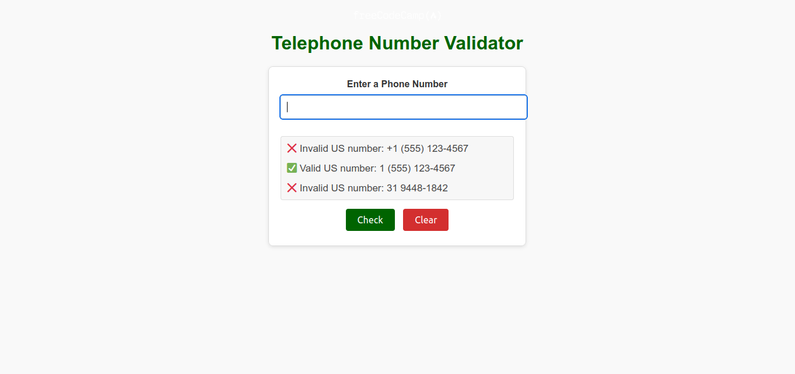

# Telephone Number Validator

This is a project challenge from FreeCodeCamp to build a telephone number validator for U.S. phone numbers. The app validates the format of the phone number entered by the user and provides feedback on whether it's a valid or invalid number.

### Features:

-  Validates U.S. phone numbers in various formats.
-  Supports numbers with or without the country code (1).
-  Allows user input and displays results.

### Technologies Used:

-  HTML
-  CSS
-  JavaScript

### How to Use:

1. Enter a phone number in the input field.
2. Click the "Check" button to validate the number.
3. The result will show whether the number is valid or invalid.

### Screenshot:

